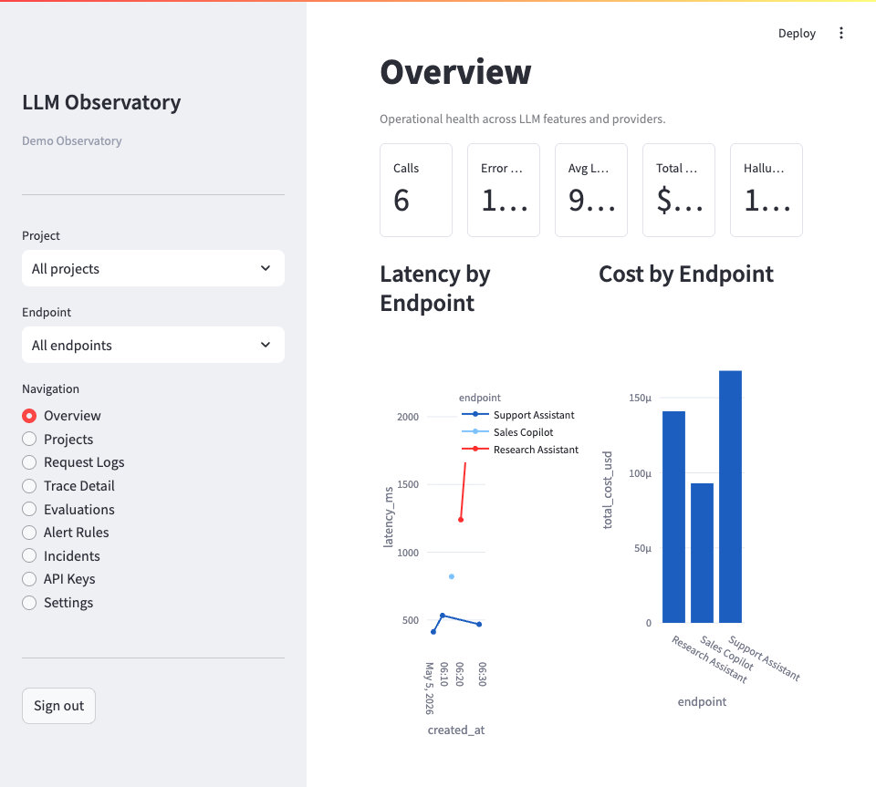
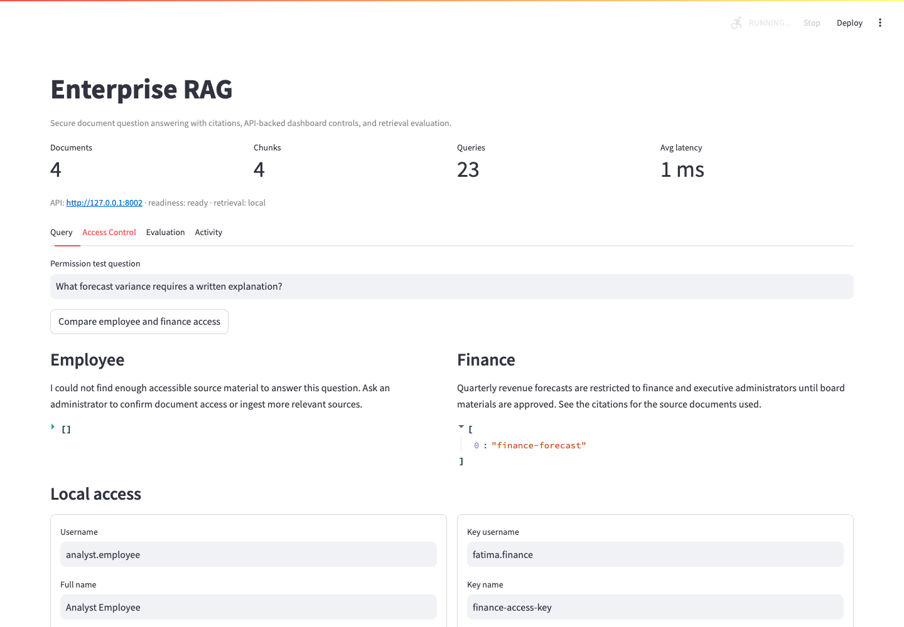
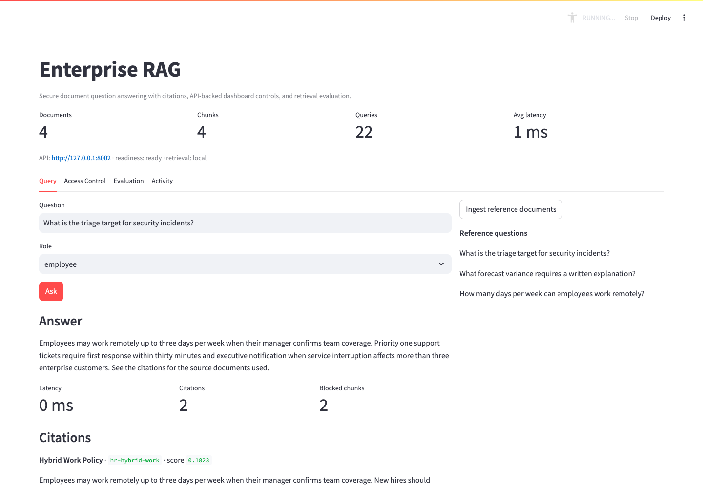
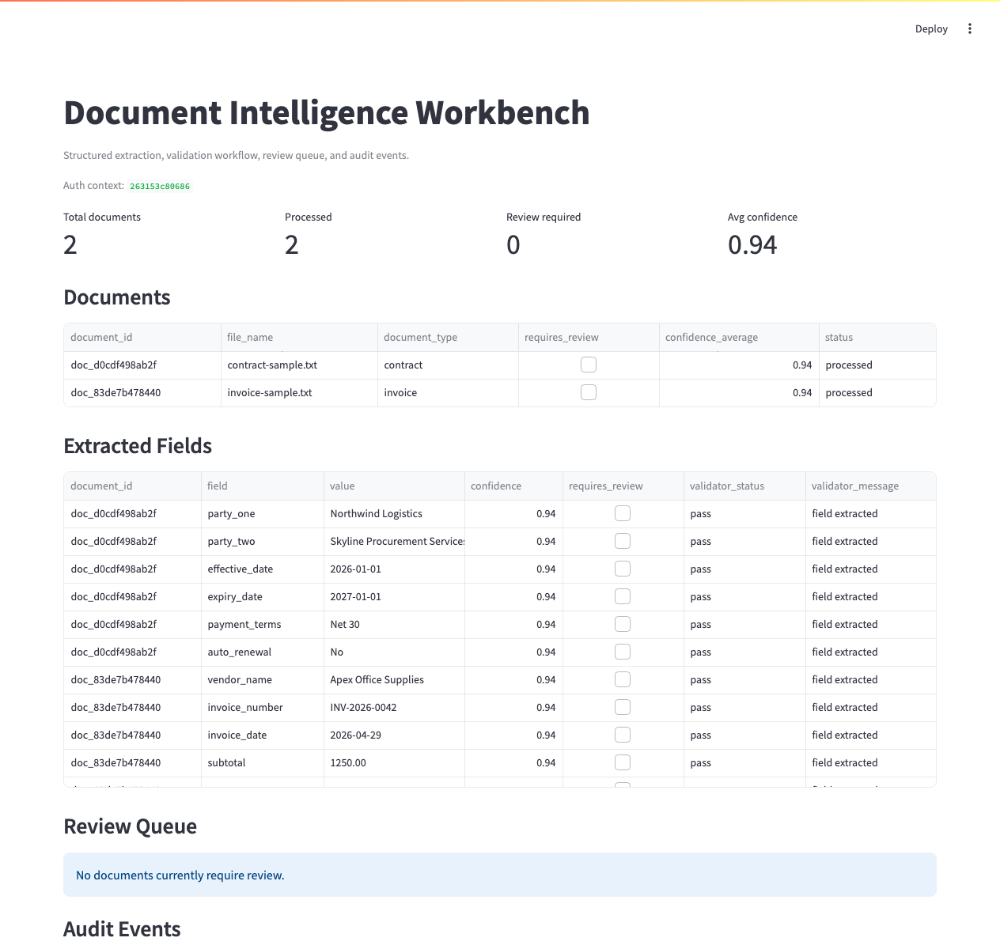
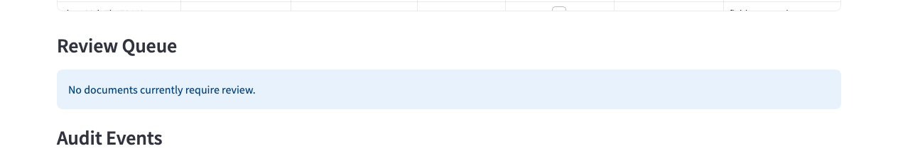
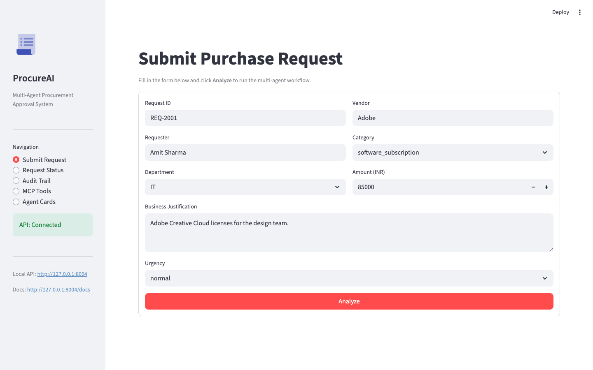
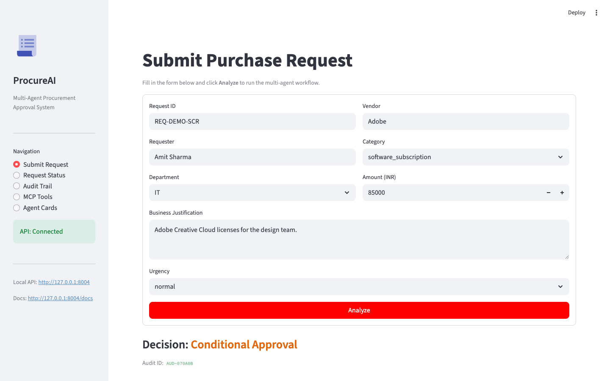
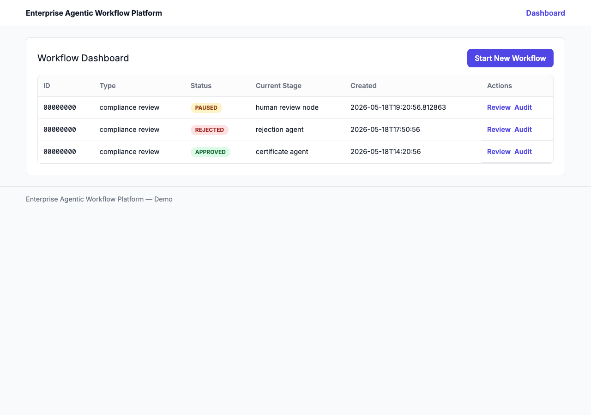
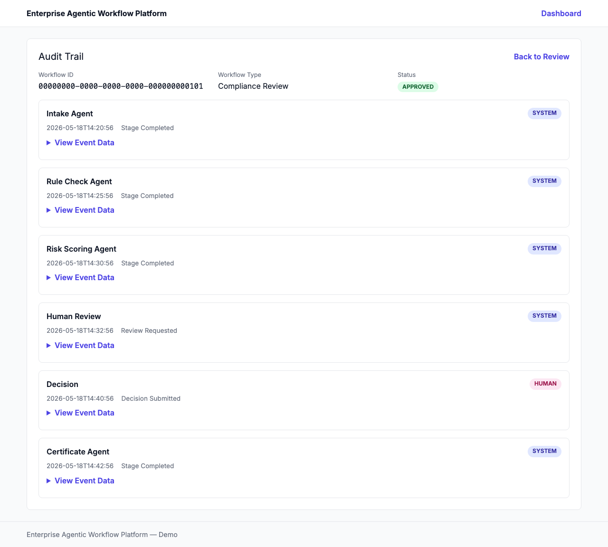

# AI Engineering Portfolio

Production-grade AI systems available for custom client engagements.
Each project is built to enterprise standards — authenticated APIs, observable infrastructure,
Azure-deployable, and documented for handoff.

> **A live demo using sample data can be arranged on request.**

---

## Projects

### 1. LLM Observatory — Production LLM Monitoring

> Real-time monitoring for hallucination risk, latency, token cost, and evaluation drift across LLM-powered features.

**Business problem:** LLM-powered features degrade silently. A prompt change, model swap, or traffic spike increases hallucinations and cost before any health check notices.

**What this delivers:**
- Proxy or ingest mode — works with any LLM provider
- Per-endpoint cost, latency, and hallucination tracking
- Automated alerting with configurable thresholds
- Role-based access for engineering, analyst, and admin teams
- Azure OpenAI, PostgreSQL, Application Insights, Key Vault ready

[→ View full brief](projects/llm-observatory/brief.md)

---

### 2. Enterprise RAG — Secure Document Knowledge Search

> Citation-backed answers from internal documents with role-based access control enforced at the retrieval layer.

**Business problem:** Employees waste time searching internal documents. General-purpose search ignores access control — a contractor can retrieve finance forecasts just by asking.

**What this delivers:**
- Every answer cites its source document, chunk, and retrieval score
- Access control applied before retrieval — restricted documents never enter the candidate set
- Measurable retrieval quality with a built-in evaluation set
- Azure OpenAI, Azure AI Search, Entra ID / OIDC, Key Vault ready

[→ View full brief](projects/enterprise-rag/brief.md)

---

### 3. Document Intelligence Workbench — Structured Extraction at Scale

> Extracts structured fields from invoices and contracts with confidence scoring, business rule validation, and human review routing.

**Business problem:** Finance and legal teams manually key data from documents into downstream systems. The work is error-prone and produces no audit record of what was extracted or corrected.

**What this delivers:**
- Confidence score per extracted field — not just a pass/fail result
- Business rule validation before anything reaches a downstream system
- Human review queue for low-confidence and failed records
- Immutable audit trail of every extraction, correction, and approval
- Azure Document Intelligence, Blob Storage, PostgreSQL ready

[→ View full brief](projects/document-intelligence/brief.md)

---

### 4. ProcureAI — Multi-Agent Procurement Approval

> Five specialist agents coordinate to validate purchase requests against policy, budget, vendor risk, and approval authority — with a full evidence trail.

**Business problem:** Purchase approvals rely on institutional memory, not the actual policy document. When a regulator asks why a $200,000 purchase was approved, the answer is in an email thread.

**What this delivers:**
- Policy, Vendor, Budget, Risk, and Approval agents each validate one domain
- Every decision cites the exact policy clause it was grounded in
- MCP-compatible tool layer — callable by any external AI agent or copilot
- A2A agent coordination with typed inputs and structured outputs
- Complete evidence packet per request, queryable audit log

[→ View full brief](projects/procureai/brief.md)

---

### 5. Multi-Agent Orchestration Platform — Enterprise Workflow Automation

> LangGraph-based platform that orchestrates multi-step workflows across AI agents and human reviewers, with persistent state and immutable audit trails.

**Business problem:** Enterprise workflows that cross systems rely on email chains and spreadsheet trackers. There is no persistent state, no guaranteed audit trail, and no visibility into where a workflow is or who touched it.

**What this delivers:**
- Workflows pause at human decision points and resume exactly where they stopped — across server restarts
- Human-in-the-loop approval as a first-class architectural primitive, not a workaround
- Pluggable workflow modules — compliance review and procurement included, custom modules addable
- Tamper-evident audit trail for every agent action and human decision
- LangGraph state machine with typed schemas and conditional routing

[→ View full brief](projects/multi-agent-workflow/brief.md)

---

## Engagement

All projects are available as:
- **Fixed-scope delivery** — defined deliverables, timeline, and acceptance criteria
- **Custom implementation** — adapted to your tech stack, data sources, and compliance requirements
- **Azure deployment** — provisioned to your tenant with handoff documentation

A live demo using sample data can be arranged on request.

---

## Technical Standards

Every project in this portfolio meets the following baseline:

| Standard | Implementation |
|---|---|
| **API** | FastAPI with typed request/response schemas |
| **Auth** | JWT + API keys, OIDC/Entra ID support |
| **Database** | PostgreSQL (production), SQLite (local dev) |
| **Containerisation** | Docker + docker-compose, named volumes |
| **CI/CD** | GitHub Actions — lint, test, build, deploy-staging, deploy-prod |
| **Infrastructure** | Azure Bicep IaC — Container Apps, Key Vault, PostgreSQL, ACR |
| **Observability** | Prometheus metrics, Application Insights, structured JSON logs |
| **LLMOps** | Langfuse tracing, token cost tracking, eval datasets |
| **Security** | Managed Identity, no hardcoded secrets, RBAC, audit logging |
| **Testing** | pytest, integration tests, golden eval datasets per project |

---

*Source code available under NDA for serious engagements. Demo environment available on request.*
