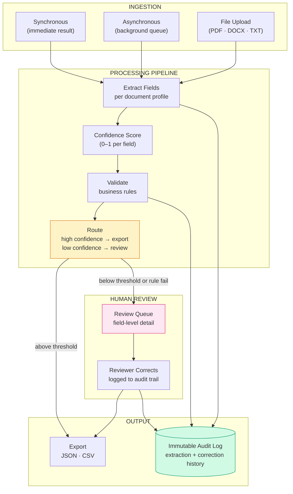

# Document Intelligence Workbench — Capability Brief

**Contact:** Manjunath Hanmantgad

---

## Problem This Solves

Finance, legal, and operations teams spend significant time manually keying data from invoices, contracts, and forms into downstream systems. The work is repetitive, error-prone, and produces no audit record of what was extracted, what was corrected, or why. Reconciliation failures — invoice totals that don't match, contract dates that contradict — are caught late and fixed manually, often after downstream systems have already consumed the bad data.

---

## What It Does

- **Extracts structured fields from invoices and contracts automatically** — vendor name, invoice totals, contract parties, dates, payment terms — with a confidence score assigned to every field
- **Validates extracted data against configurable business rules** — invoice total must equal subtotal plus tax; contract expiry must be after effective date; required fields must be present
- **Routes low-confidence and failed records to a human reviewer** — reviewer sees exactly which fields need attention and why, corrects in place, and every action is logged to an immutable audit trail

---

## How It Works

---

## Screenshot

*Extraction metrics, per-document confidence scores, field-level validation results, review queue — all in one view.*

---

## Key Capabilities

| Capability | Business Value |
|------------|---------------|
| Profile-driven extraction | Add a new document type by defining a profile — no code changes to the pipeline |
| Confidence scoring | Every field carries a certainty value — uncertain extractions flagged automatically before they reach downstream systems |
| Configurable validation rules | Business rules defined as configuration — invoice total reconciliation, date logic, required field checks |
| Human review queue | Low-confidence and failed records surfaced with field-level context — reviewers correct, not re-key |
| Immutable audit trail | Original extraction + every correction logged with reviewer identity and timestamp |
| Async processing queue | High-volume document batches processed in background with exponential backoff on failure |
| JSON and CSV export | Clean validated records ready for ERP, accounting, or CRM import |
| Prometheus metrics | Processing volume, review rate, average confidence — all monitorable |

---

## Supported Document Types (Built-In)

| Type | Extracted Fields |
|------|-----------------|
| Invoice | Vendor name, invoice number, date, subtotal, tax, total, currency |
| Contract | Party one, party two, effective date, expiry date, payment terms, auto-renewal |

Additional document types — purchase orders, bills of lading, insurance forms — are added as extraction profiles without changing the processing pipeline.

---

## How This Would Be Customised for You

The processing pipeline, confidence scoring, validation engine, and review queue are fixed infrastructure. What changes per client is the document type profiles (the fields to extract for your specific documents) and the validation rules (your specific business logic). For most engagements, the custom work is defining extraction profiles and rules for your document types — typically 1–2 weeks per new document type.

---

## Deployment Options

| Option | Detail |
|--------|--------|
| Local | Deterministic extraction, SQLite, no external dependencies — suitable for demo and internal use |
| Azure | Azure AI Document Intelligence + Azure OpenAI + PostgreSQL + Container Apps + Blob Storage |
| Hybrid | Local processing, Azure document storage and managed database |

---

## Engagement Options

| Type | Scope |
|------|-------|
| Document audit | 1 week — assess your document types, define extraction profiles, produce validation rules |
| Proof of concept | 2–3 weeks — working extraction for one document type with your sample documents |
| Full implementation | 6–8 weeks — multi-document-type system with review queue and ERP/CRM export integration |
| Advisory | Monthly — ongoing quality monitoring and profile maintenance |

---

*This brief describes a proprietary custom implementation.*
*A live demo using sample data can be arranged on request.*
