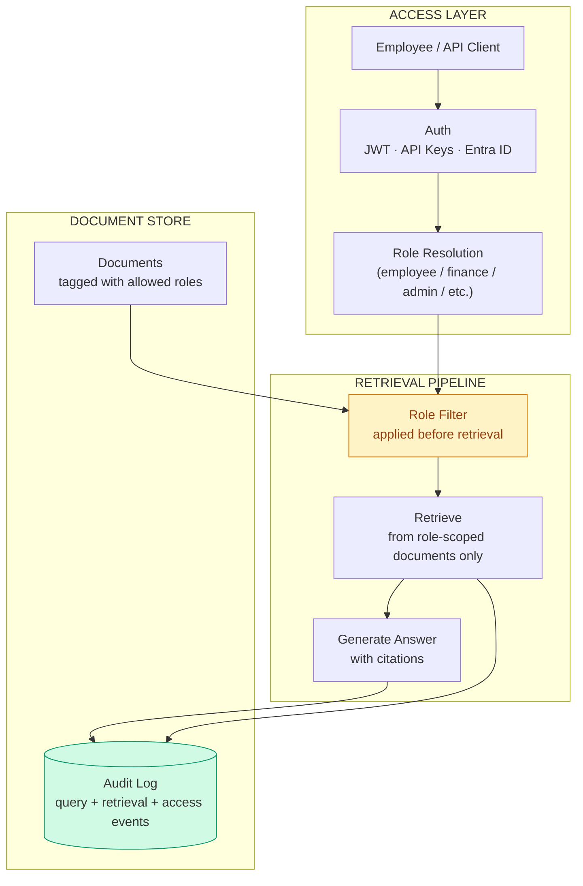

# Enterprise Knowledge Search — Capability Brief

**Contact:** Manjunath Hanmantgad

---

## Problem This Solves

Enterprise knowledge is scattered across policy documents, finance reports, security runbooks, and HR guides. Employees either waste time searching, ask colleagues who may give inconsistent answers, or skip the search entirely. The deeper problem is access control — a general search that returns finance forecasts to an employee, or security procedures to a contractor, is a compliance and data governance risk that most RAG systems ignore entirely.

---

## What It Does

- **Returns citation-backed answers from internal documents** — every response identifies the exact source document and section used; answers are traceable and auditable
- **Enforces access control at the retrieval layer** — restricted documents are excluded from the candidate set before any AI processing, not filtered from the response after the fact
- **Measures retrieval quality continuously** — a built-in evaluation set tracks citation coverage, answer accuracy, and restricted document leakage on every run

---

## How It Works

---

## The Access Control Differentiator

The same question. Two roles. Two different answers — because the restricted document was never retrieved for the employee role.

*Left: Employee role — finance forecast not in scope, access correctly denied. Right: Finance role — restricted document retrieved and cited.*

---

## Citation-Backed Answers

*Every answer names the source document, chunk, and retrieval score. No answer without a citation.*

---

## Measurable Quality

*Evaluation set: pass rate, citation coverage, and restricted document leakage count. Zero leakage is the compliance proof.*

---

## Key Capabilities

| Capability | Business Value |
|------------|---------------|
| Pre-retrieval access control | Restricted documents cannot appear in any answer, regardless of how the question is phrased |
| Citation traceability | Every answer is auditable — source document and section identified per claim |
| Built-in evaluation | Retrieval quality is a measurable number, not an opinion |
| Multi-role document tagging | Documents tagged with allowed roles — new role = configuration change, not code change |
| OIDC / Entra ID auth | Integrates with existing enterprise identity — no separate user database |
| Pluggable retrieval backends | Local lexical search for demos; Azure AI Search for production scale |
| Prometheus metrics | Query volume, latency, access control block rate — all monitorable |

---

## Supported Document Types

| Type | Notes |
|------|-------|
| Markdown / plain text | Local ingestion, immediate availability |
| Azure Blob Storage | Production document source |
| Azure AI Search index | Full-text and vector search at scale |

New document types require one new ingestion adapter.

---

## How This Would Be Customised for You

The retrieval engine, access control layer, and citation system are fixed infrastructure. What changes per client is the document corpus, the role model (your specific roles and permissions), and the auth integration (your Entra ID tenant or OIDC provider). For most engagements, the custom work is ingesting your documents and mapping your identity provider — typically 2–3 weeks.

---

## Deployment Options

| Option | Detail |
|--------|--------|
| Local | Lexical search, SQLite, mock LLM — no external dependencies |
| Azure | Azure AI Search + Azure OpenAI + Entra ID + PostgreSQL + Container Apps |
| Hybrid | Local processing, Azure AI Search index, Entra ID auth |

---

## Engagement Options

| Type | Scope |
|------|-------|
| Document audit | 1 week — assess your document corpus, define role model, produce ingestion plan |
| Proof of concept | 2–3 weeks — working search over a sample of your documents with your roles |
| Full implementation | 6–10 weeks — production system with your document corpus, Entra ID, Azure AI Search |
| Advisory | Monthly — ongoing governance and quality monitoring |

---

*This brief describes a proprietary custom implementation.*
*A live demo using sample data can be arranged on request.*
