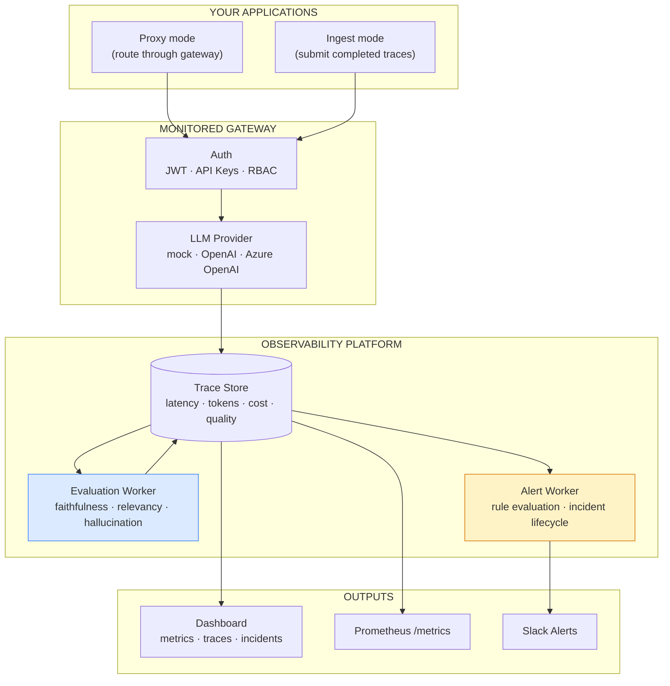

# LLM Observatory — Capability Brief

**Contact:** Manjunath Hanmantgad

---

## Problem This Solves

LLM-powered features degrade silently. A prompt change, a model update, a retrieval issue, or a traffic spike can increase hallucinations, latency, and cost before any standard health check notices anything. Engineering teams operating multiple LLM endpoints — support, sales, research, internal tools — typically have no visibility into which endpoint is expensive, which responses are low quality, or whether hallucination risk is trending upward.

---

## What It Does

- **Centralises all LLM traffic through a monitored gateway** — every call captured with latency, token usage, cost, and response metadata, without changing application code
- **Evaluates response quality automatically** — faithfulness, relevancy, and hallucination scoring applied to responses using LLM-as-judge evaluation with deterministic fallback
- **Alerts on quality and cost thresholds** — configurable alert rules create incidents when metrics breach limits; incidents tracked through acknowledge → resolve lifecycle with Slack notification

---

## How It Works

---

## Screenshots

**Operations Dashboard** — latency by endpoint, cost by endpoint, call volume, error rate

**Incident Management** — active incidents with severity, trigger context, and resolution controls

---

## Key Capabilities

| Capability | Business Value |
|------------|---------------|
| Gateway-intercepted tracing | All LLM calls captured without changing application code — proxy mode or trace ingest |
| Per-endpoint cost tracking | Know exactly which product feature is spending money and how much |
| Quality evaluation | Faithfulness, relevancy, and hallucination scored per response — quality is a number, not an opinion |
| Threshold alerting | Define acceptable latency, cost, and hallucination limits — breach creates an incident |
| Incident lifecycle | Acknowledge and resolve incidents with full audit trail |
| Multi-org / multi-project | Separate visibility per team, product, or endpoint — suitable for multi-tenant platforms |
| Prometheus metrics | `/metrics` endpoint for Grafana, Datadog, or any scraper |
| Mock LLM mode | Full platform runs without an API key — deterministic responses for demos and CI |
| Azure-ready | Azure OpenAI, Azure PostgreSQL, Key Vault, Container Apps, Application Insights paths documented |

---

## Metrics Captured

| Category | What Is Measured |
|----------|-----------------|
| Usage | Total calls, calls by endpoint, session ID |
| Latency | Per-call latency, average by endpoint |
| Cost | Prompt tokens, completion tokens, total cost, cost by endpoint |
| Quality | Faithfulness score, relevancy score, hallucination flag |
| Reliability | Status, failed call count, error text |

---

## How This Would Be Customised for You

The gateway, evaluation pipeline, alerting engine, and dashboard are fixed infrastructure. What changes per client is the alert rule configuration (your thresholds for latency, cost, and quality) and the organisation/project structure (mapping to your teams and endpoints). For most engagements, the custom work is configuring alert rules and connecting your LLM provider credentials — typically 1–2 weeks.

---

## Deployment Options

| Option | Detail |
|--------|--------|
| Local | SQLite, mock LLM, no external dependencies — suitable for demo and internal use |
| Azure | Azure OpenAI + Azure PostgreSQL + Key Vault + Container Apps + Application Insights |
| Hybrid | Local gateway, Azure storage and monitoring |

---

## Engagement Options

| Type | Scope |
|------|-------|
| Observability audit | 1 week — assess your current LLM usage, define metrics and alert thresholds |
| Proof of concept | 2 weeks — gateway monitoring your existing LLM endpoints with dashboard |
| Full implementation | 4–6 weeks — production observatory with your providers, alert rules, and Grafana integration |
| Advisory | Monthly — ongoing quality monitoring and threshold tuning |

---

*This brief describes a proprietary custom implementation.*
*A live demo using sample data can be arranged on request.*
