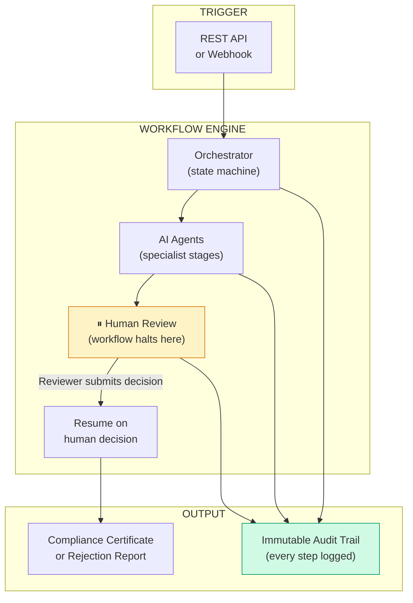
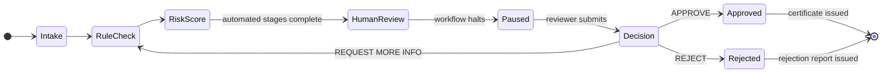

# Enterprise Agentic Workflow Platform — Capability Brief

**Contact:** Manjunath Hanmantgad

---

## Problem This Solves

Enterprise approval workflows — compliance reviews, vendor sign-offs, contract approvals — run on email chains and spreadsheets. There is no persistent state, no guaranteed audit trail, and no visibility into where a decision is, who touched it, or why it was made. When a reviewer is unavailable, the workflow stops. When regulators ask questions, the answer is in someone's inbox.

---

## What It Does

- **Orchestrates multi-step workflows across AI agents and human reviewers** — each stage runs automatically until a human decision is required, at which point the workflow pauses and waits
- **Enforces human-in-the-loop approval as an architectural primitive** — the workflow genuinely halts, persists its state, and resumes only when a qualified reviewer submits a decision via the review interface
- **Produces a tamper-evident audit trail for every workflow run** — every agent action, rule evaluation, risk score, and human decision is logged with timestamp, actor, and structured payload — permanently

---

## How It Works

---

## Compliance Review — Workflow Stages

The compliance review workflow demonstrates the platform at its most structured. Every stage is logged. The human review step genuinely pauses the workflow — state persists across server restarts. The reviewer sees the full automated analysis before making a decision.

---

## Screenshots

**Workflow Dashboard** — three active workflows in different states

**Human Review Screen** — reviewer sees extracted data, rule results, risk score, and submits decision

**Audit Trail** — complete ordered event log from document intake to certificate generation

---

## Key Capabilities

| Capability | Business Value |
|------------|---------------|
| Stateful workflow orchestration | Workflows survive server restarts — no lost approvals, no silent failures |
| Genuine human-in-the-loop | Reviewer sees full automated context; decision is logged with notes and timestamp |
| Pluggable workflow modules | Add a new workflow type without changing the orchestration engine |
| Immutable audit trail | Every decision defensible in audit or regulatory review |
| Configurable rule engine | Compliance rules defined as configuration, not hardcoded logic |
| LLM risk scoring | AI-generated risk assessment with explicit reasoning before human review |
| Azure-ready deployment | Local SQLite → Azure Postgres; API keys → Key Vault; single env var change per component |

---

## Workflows Included

| Workflow | Stages |
|----------|--------|
| **Compliance Review** | Document intake → Rule check → Risk scoring → Human review → Decision → Certificate |
| **Procurement Approval** | Vendor intake → Due diligence → Human approval → CRM update |

Additional workflows can be added as independent modules.

---

## How This Would Be Customised for You

The orchestration engine, approval mechanism, and audit trail are fixed infrastructure — they do not change per client. What changes is the workflow module: the specific stages, the rules, the document types, and the integration endpoints (CRM, ERP, notification systems). A new workflow for your use case — HR onboarding, contract review, budget approval — is typically 2–3 weeks of implementation on top of the existing platform.

---

## Deployment Options

| Option | Detail |
|--------|--------|
| Local / on-premise | Runs entirely within your infrastructure — no external dependencies |
| Azure | Container Apps + Azure Postgres + Key Vault + Azure OpenAI |
| Hybrid | Local processing, Azure storage and identity |

---

## Engagement Options

| Type | Scope |
|------|-------|
| Architecture workshop | 2 days — map your workflows to the platform, produce implementation plan |
| Proof of concept | 3–4 weeks — one workflow end-to-end with your data |
| Full implementation | 8–12 weeks — multi-workflow platform with your integrations |
| Advisory | Monthly — architecture guidance and platform evolution |

---

*This brief describes a proprietary custom implementation.*
*A live demo using sample data can be arranged on request.*
