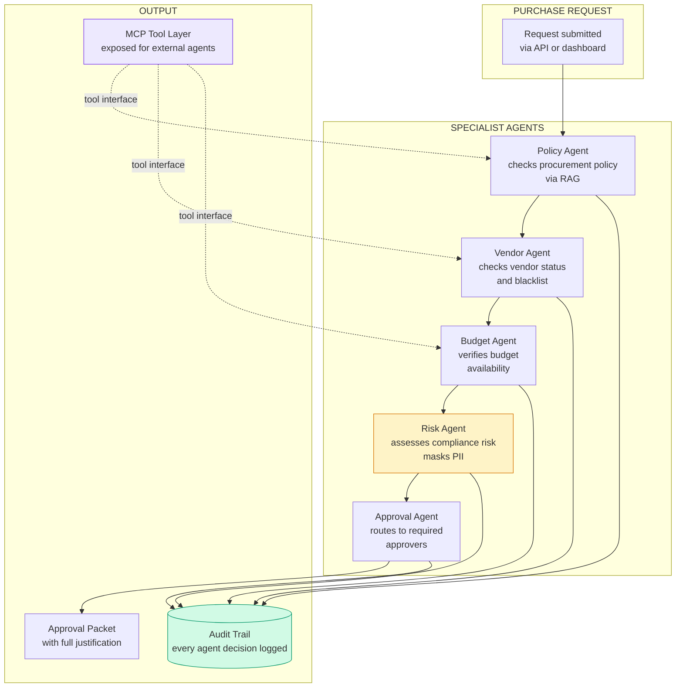

# ProcureAI — Multi-Agent Procurement Brief

**Contact:** Manjunath Hanmantgad

---

## Problem This Solves

Purchase requests in most organisations are validated inconsistently. Policy checks depend on who is reviewing. Budget availability is confirmed manually by emailing finance. Vendor status is assumed rather than verified. The result is approvals that should have been rejected and rejections that lacked justification. When auditors ask why a purchase was approved, the answer is "someone checked it."

---

## What It Does

- **Validates purchase requests against procurement policy automatically** — policy documents are indexed and queried per request; every policy decision is cited with the specific clause
- **Coordinates five specialist agents in sequence** — policy compliance, vendor status, budget availability, risk assessment, and approval routing each run independently with typed inputs and outputs
- **Routes to the correct approvers based on configurable rules** — approval requirements defined in a YAML matrix; amount, category, and risk level determine who must sign off

---

## How It Works

---

## Key Capabilities

| Capability | Business Value |
|------------|---------------|
| Multi-agent orchestration | Five independent specialist agents — each with typed inputs/outputs, each replaceable |
| Policy RAG | Policy documents indexed and queried per request — decisions cite specific policy clauses |
| Vendor blacklist check | Blacklisted vendors rejected automatically — no manual lookup required |
| Budget verification | Budget availability confirmed against department records before approval routing |
| YAML approval matrix | Approval requirements defined as configuration — amount thresholds, categories, required approvers |
| PII masking | Sensitive data scrubbed before risk analysis — safe for external processing |
| MCP tool layer | All agent capabilities exposed as MCP-compatible tools — callable by external AI systems and copilots |
| A2A agent cards | Each agent publishes a card with capabilities and schemas — enables inter-agent discovery |
| Full audit trail | Every agent decision, policy citation, and approval action logged |

---

## Agent Responsibilities

| Agent | What It Checks |
|-------|---------------|
| Policy Agent | Is this purchase compliant with procurement policy? Which clauses apply? |
| Vendor Agent | Is this vendor approved? Are they on the blacklist? What is their status? |
| Budget Agent | Does the requesting department have budget available for this amount? |
| Risk Agent | What compliance risks does this request carry? Is there sensitive data to mask? |
| Approval Agent | Who must approve based on amount, category, and risk level? |

---

## MCP Integration

The platform exposes all agent capabilities as MCP-compatible tools. External AI systems — copilots, chat assistants, workflow engines — can call individual checks without going through the full pipeline:

| MCP Tool | What It Does |
|----------|-------------|
| `search_policy_docs` | Query procurement policy documents |
| `validate_policy_compliance` | Check a request against policy rules |
| `lookup_vendor` | Get vendor status and risk flags |
| `check_budget_availability` | Verify department budget for an amount |
| `generate_approval_packet` | Produce structured approval output |

---

## How This Would Be Customised for You

The agent orchestration framework, MCP tool layer, and audit trail are fixed infrastructure. What changes per client is the policy document corpus (your procurement policies), the vendor and budget data sources (your ERP or spend management system), and the approval matrix (your approval thresholds and approver roles). Real ERP and vendor system integrations replace the built-in data stores. Typically 4–6 weeks for a full implementation with real data source integrations.

---

## Deployment Options

| Option | Detail |
|--------|--------|
| Local | SQLite vendor/budget stores, keyword policy search — suitable for demo |
| Azure | Azure OpenAI + Azure PostgreSQL + Container Apps + Key Vault |
| Integration | Connect to your ERP (SAP, Oracle, Dynamics) for live vendor and budget data |

---

## Engagement Options

| Type | Scope |
|------|-------|
| Policy audit | 1 week — index your policy documents, define approval matrix, map agent responsibilities |
| Proof of concept | 3–4 weeks — working validation for one purchase category with sample data |
| Full implementation | 8–12 weeks — production system with ERP integration and real vendor/budget data |
| Advisory | Monthly — policy maintenance and approval matrix tuning |

---

*This brief describes a proprietary custom implementation.*
*A live demo using sample data can be arranged on request.*
